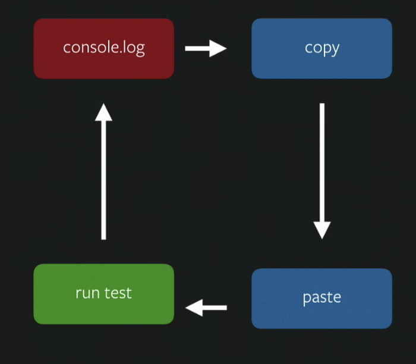
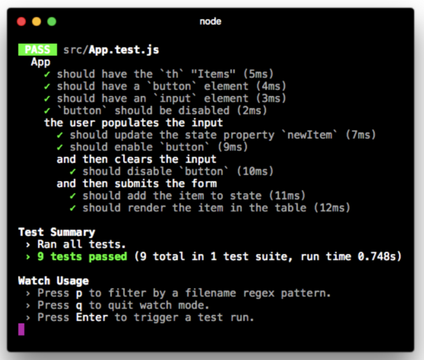

Testing code is probably one of the most important things to do in software engineering. Testing ensures the quality of what we are building. There are many ways to test code, from end-to-end testing (manual testing) to unit testing (component testing in React). In this document, we’ll cover some of the most common and effective ways to test React code using Jest, Enzyme, and other great tools.

A solid testing strategy saves time in the long run. By catching issues early, you keep regressions out of production and make refactoring safer as your project scales.

## What is the Test Pyramid?

In Agile frameworks, automated testing can be grouped into a testing pyramid. A testing pyramid illustrates when we should use one testing method versus another. The pyramid shows that many unit-snapshot tests can be used to validate one integration test, and many integration tests can be used to validate one manual test. At the peak of the pyramid, we have an end-to-end test: manual testing of the whole application. The idea of choosing what type of tests should be used is important, as we may be testing the same thing in two or three different levels of the pyramid.


Manual testing is slow and unsustainable. This type of testing works for our front-end applications because it mimics how the user will interact with our application. The problem with this testing is that it is expensive to maintain (any minor UI change may break the tests, because these tests are normally done with Selenium, a web browser emulator) and the time to develop one of this tests may be high. It’s important to note that we don’t usually use this type of testing in front-end applications due to high costs.

Integration testing may be good to test connections between components and finding bugs in these liaisons. For example, let’s imagine we want to test if a parent component passes specific props to a child whenever a user clicks a button. The cost of maintaining and doing these tests is not very high and will test parts that we don’t test with unit tests.
Unit/Snapshot testing is probably the easiest way to test components. We only focus on one isolated item and its logic. If we follow the presentation-functional components division, it will even be easier to test this. For presentational components, we give the props to the component and expect a specific render (could be a good use case for snapshot). In functional testing, the tests can be more tricky. We need to mock a redux store to create user actions, and we expect redux actions to be called by the mocked store while we simulate events.

As rule of thumb for frontend development, start with unit/snapshot testing. Proceed to an integration test only if necessary. Try to avoid manual/UI testing. We can use Jest as our main testing tool for the first two steps of the pyramid.

## Why use Jest?

###### _Make Testing Great Again_

Jest is a testing framework created by Facebook. Facebook uses it to test JavaScript and React code. It was created under the premise of performance, features and adaptability. Jest provides an integrated “zero-configuration” experience. This is a differentiator from other popular testing frameworks like Mocha. Some of the killer features are:

- **Instant Feedback**: Immersive Watch mode only runs test files related to changed files.
- **Fast and sandboxed**: It runs parallel tests across workers, and buffers console messages and prints them together.
- **Snapshot Testing**: Capture snapshots of React trees or other serializable values to simplify testing and analyze how state changes over time.
- **Built-in code coverage reports**: Supports —-coverage for bringing out of the box coverage reports.
- **Zero configuration**

### How do Jest matchers work?

Matchers are the most basic unit for testing in Jest. They are used to assert that an expected object is equal, close to, greater, or less than, or contains any other logical connection to another output object. We can create different constructions with these logical connections. For more reference, check Jest <Link underline href="https://jestjs.io/docs/en/expect">documentation</Link>.

```JavaScript
test(‘object assignment’, () => {
  const data = {one: 1};
  data[‘two’] = 2;
  expect(data).toEqual({one: 1, two: 2});
});

test(‘increasing a positive number is not zero’, () => {
 let a = 1;
 expect(a + 1).not.toBe(0);
});

test('zero', () => {
  const z = 0;
  expect(z).not.toBeNull();
  expect(z).toBeDefined();
  expect(z).not.toBeUndefined();
  expect(z).not.toBeTruthy();
  expect(z).toBeFalsy();
});

test('adding floating point numbers', () => {
  const value = 0.1 + 0.2;
  // It fails because in JavaScript 0.2 + 0.1 = 0.30000000000000004
  // expect(value).toBe(0.3);
  // This works with a precision of 5.
  expect(value).toBeCloseTo(0.3, 5);
});
```

We can even test that an expected function throws an error:

```JavaScript
function compileAndroidCode() {
 throw new ConfigError(‘you are using the wrong JDK’);
}
test(‘compiling android goes as expected’, () => {
 expect(compileAndroidCode).toThrow();
 expect(compileAndroidCode).toThrow(ConfigError);
// You can also use the exact error message or a regexp
 expect(compileAndroidCode).toThrow(‘you are using the wrong JDK’);
 expect(compileAndroidCode).toThrow(/JDK/);
});
```

### How do you mock functions in Jest?

###### _If you aren’t mocking, you aren’t unit testing._

Mocking is a useful way to isolate components and functions. To do this, we define the output of our function/dependency. A good mock is the one that mimics all corner cases. Another excellent Jest feature is the ease of creating mocking functions/dependencies.

```JavaScript
test('computeList calls callback in array', () => {
    function computeList(items, callback) {
      for (let index = 0; index < items.length; index++) {
        callback(items[index])
      }
    }
    const mockCallback = jest.fn()
                          .mockReturnValue(32)
    computeList([0, 1], mockCallback)
    // The mock function is called twice
    expect(mockCallback.mock.calls.length).toBe(2)
    // The first argument of the first call to the function was 0
    expect(mockCallback.mock.calls[0][0]).toBe(0)
})
```

### How do you set up and tear down tests?

A good practice in Jest is organizing data in blocks. To do this, we can use `describe` function that receives two arguments: first the block name and then a function that will either have more organized blocks or test functions. To make it more modular, Jest provides a set of functions that will control code execution before and after we runtests.

```JavaScript
describe('City Database', () => {
    beforeAll(() => {
        initEnvironment()
    })

    beforeEach(() => {
        initCityDB()
    })

    afterEach(() => {
        clearCityDB()
    })

    test('has Vienna', () => {
        expect(isCity('Vienna').toBeTruthy())
    })

    test('has San Juan', () => {
        expect(isCity('San Juan').toBeTruthy())
    })
})
```

## What is snapshot testing in Jest?

###### _As projects evolve and change, code and tests need to evolve too._

The most complex part of writing unit tests for long-term projects is the maintenance. As project evolves, code evolves and naturally, tests evolve. Certain functions or components may change the output deliberately and tests may need to adapt their assertions. As illustrated in the image, this adaptation often has repetitive tasks. 2. Snapshot testing is a way to automate this process and create unit tests that can easily be overwritten and managed through time. The main benefit of snapshot testing is that we can quickly create tests for black boxes without much configuration, and adapt them to changes easily.



Imagine a function that filters a list of objects when given a keyword. One of the tests could be written as follows:

```JavaScript
test('function filters users', () => {
    expect(filterUsers('b').toEqual([
        { name: 'Becky' },
        { name: 'Bob' },
        { name: 'Bryan' },
        { name: 'Bryce' }
    ]))
})
```

But, what happens if we add users or change schema? We have to change the test, copying and pasting the assertion to make the test pass. The logic didn’t change, only the expected output. This can happen multiple times in a project. Snapshots are the solution to making this repetitive process automatic and auto-generated.

```JavaScript
test('filters items', () => {
    expect(filterUsers('b')).toMatchSnapshot()
})
```

Jest has a built-in module that manages the creation and update of snapshots. It will save the snapshot in a directory titled _**snapshots**_. Whenever we run Jest (if that directory exists), it will compare the output with the saved output. If it’s different we can easily overwrite the saved snapshot or check in the code for a possible bug. The following is an auto-generated snapshot:

```JavaScript
// Jest Snapshot v1, https://goo.gl/fbAQLP
exports[`Snapshots filters users 1`] = `
Array [
  Object {
    "name": "Becky",
  },
  Object {
    "name": "Bob",
  },
]
`;
```

## How do you test React components?

Everything we’ve discussed so far doesn’t have a direct connection with React. All the previous tools may be used to test the logic of our front-end application. In frontend applications not everything is logic; we have a presentation that should be tested. But, how can we test this? The rule of thumb is that we should test everything that isn’t static. In other words, we should test two things:

1. Given a set of inputs (state & props), assert what a component should output (render).
2. Given a user action, assert how the component behaves. The component might make a state update or call a prop-function passed down from a parent.



That is great, but if you think it twice, what would be the output of the presentational component that we’ll be testing or snapshotting? It would be the React Tree generated. Enzyme is the tool we’ll use to easily render without problems React Trees that could even be isolated (not rendering child components, for example).

### What is Enzyme and how does it help?

Enzyme is a testing tool developed and managed by Airbnb. Enzyme uses several of the utilities provided by React to build its API. The API reduces boilerplate code.

```JavaScript
import App from '../App'
describe('App component', () => {
  test('should shallow correctly', () => {
      expect(shallow(
        <App />
      )).toMatchSnapshot()
  })
  test('should mount correctly', () => {
      expect(mount(
        <App />
      )).toMatchSnapshot()
  })
  test('should render correctly', () => {
      expect(render(
        <App />
      )).toMatchSnapshot()
  })
})
```

Enzyme has three methods for rendering React components. These methods give different results and we use them in different cases. We recommend always starting with Shallow. Use mount only when you need to test something related to the lifecycle. Render should be used when we want to test the children.

1.  **Shallow**: Shallow rendering is useful to constrain yourself to testing a component as a unit, and to ensure that tests aren’t indirectly asserting the behavior of child components.
2.  **Mount**: Full rendering and it doesn’t need an environment like a “browser”. This is useful when you want to test the children with less overhead than mount.
3.  **Render**: Full DOM rendering is ideal for use cases where you have components that may interact with
4.  **DOM APIs**. Full rendering actually mounts the component in the DOM. This is the only way to test componentDidMount and componentDidUpdate.

We have API methods for the three methods that may help us in our assertions. Two of the most important are “simulate” and “find”. The first one can simulate user events like click, hover, etc. The second method can find a child with a selector.

```JavaScript
describe('the user populates the input', () => {
    const testem = 'Vancouver'
    beforeEach(() => {
        const input = wrapper.find('input').first()
        input.simulate('change', {
          target: { value: testem }
        })
      })
  test('should update the state property `testem`', () => {
        expect(
          wrapper.state().testem
        ).toEqual(testem)
  })
})
```

We are now ready to test our React application. Code with more concrete examples can be found <Link underline href="https://github.com/timgivois/jest-talk">here</Link>.

## Where can you learn more about SEO for personal blogs?

See [Google's SEO starter guide](https://developers.google.com/search/docs/fundamentals/seo-starter-guide) and [Ahrefs' SEO best practices](https://ahrefs.com/blog/seo-best-practices/) for tips that help your posts rank better.
