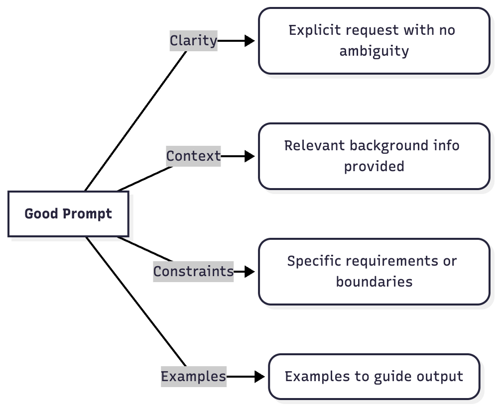

AI coding assistants like ChatGPT and GitHub Copilot are becoming standard tools in a developer’s toolkit. In fact, over 80% of developers now use AI in their workflow, and nearly half the code in some projects is AI-generated. But simply having access to an LLM (Large Language Model) isn’t enough – the real productivity boost comes from mastering prompt engineering. A poorly phrased request can yield generic or buggy code, while a well-crafted prompt produces accurate, production-ready solutions. Prompt engineering isn’t just for marketers or content writers; it’s a crucial skill for software engineers to communicate with AI effectively and get the results they need in coding tasks.

In this post, we’ll explore how developers can craft better prompts for coding assistance. We’ll cover what makes a good prompt (clarity, context, constraints, and examples), give developer-specific prompt examples (like refactoring code or generating tests), highlight common prompt pitfalls (and how to avoid issues like ambiguity or AI hallucinations), and discuss integrating prompt engineering into your workflow (from code reviews to CI/CD). By the end, you’ll have practical techniques and resources to level up your “AI prompting” game and turn these tools into true pair programmers.

## What Makes a Good Prompt?

Not all prompts are created equal. The core reason many AI outputs miss the mark is **ambiguity in the question** – the model can’t read your mind. Effective prompts eliminate guesswork by providing structure, context, and [clarity](https://www.andriifurmanets.com/blogs/prompt-engineering-for-developers/). For developers, a good prompt clearly conveys **what you need, background info, specific requirements**, and sometimes **examples**. Here are the key elements:

- **Clarity**: Be explicit about what you want. **Avoid vague instructions** like **“Fix this”** or **“Make it better.”** Instead, specify the goal or ask a concrete question. For example, rather than **“Make this faster,”** say **“Optimize this function to handle 10,000 items under 100ms, and explain the changes.”** This leaves no ambiguity about what [“faster” means](https://www.andriifurmanets.com/blogs/prompt-engineering-for-developers/). Clear prompts result in more focused, relevant answers.
- **Context**: Provide relevant background or environment details. The AI should know the bigger picture of your code or problem. For instance, mention the framework, language, or purpose of the code. Context: “This is a Python data processing script using pandas, and it’s running out of memory on large CSV files.” By giving context, the model can tailor the solution appropriately (e.g. using pandas best practices or streaming data). Lack of context is a common cause of [unsatisfactory](https://www.andriifurmanets.com/blogs/prompt-engineering-for-developers/).
- **Constraints & Requirements**: Set boundaries or criteria for the solution. These act as guardrails for the AI. You might specify performance targets, libraries to use or avoid, coding style guidelines, security or compliance needs, etc. For example: “Use only standard Python libraries,” or “The solution must handle Unicode characters and run in O(n) time complexity.” Including such constraints guides the model to produce output that fits your needs. Without constraints, the AI might go off-track or produce irrelevant content.
- **Examples**: If applicable, give examples of the desired output or format. For coding tasks, this could mean providing a snippet of input and the expected output format, or a template for how the answer should look. Few-shot prompting (showing one or two examples) can drastically improve reliability for tasks like generating code in a certain style or outputting data in JSON. For instance: “Here’s an example log line and how it should be parsed. Now parse all these lines…” By demonstrating the pattern, you reduce ambiguity. Including examples or a step-by-step breakdown is especially helpful if the task is complex.

In practice, many effective developer prompts follow a structure that covers the above points. Some experts use frameworks like “Persona, Context, Task, Format” (PCTF) – e.g. “You are a senior Python engineer (Persona). Context: [project details]. Task: [specific request]. Format: [any output requirements].” The key is to be specific and informative: tell the AI who it should be, what it’s working with, what exactly to do, and how the answer should look. Covering those bases sets the model up for success.

## Developer-Specific Prompt Examples

Let’s look at how a developer might apply prompt engineering to common scenarios. Crafting prompts for coding tasks often means speaking to the LLM like you would to a junior developer or rubber duck – clear instructions, plenty of context, and a dash of patience. Here are a few examples:

### Refactoring Code for Performance

**Scenario**: You have a function that works correctly but is too slow or resource-heavy.

Naïve Prompt (too vague): “Refactor this code for performance.”

This prompt gives the AI no clue what to optimize or how to measure success. The assistant might return a generic rewrite or even something incorrect.

Better Prompt: **“You are an experienced performance engineer. I have a Java function (below) that processes a list of orders but runs in O(n^2) time. Refactor this function to handle 10,000 orders in under 100ms by using a more efficient algorithm or data structure. Explain why the new approach is faster, and ensure the refactored code passes the same unit tests.”**

In this improved prompt, we specified the role (performance engineer), the context (Java function for order processing), the exact problem (current complexity and target performance), and even requested an explanation. The AI now knows the success criteria and can focus its solution on, say, using a hash map for faster lookups or reducing nested loops. Including a requirement to explain changes also helps catch any AI **hallucinations** – if it claims better performance, the reasoning must make sense. By being explicit, we turn **“make it faster”** into a concrete engineering task.

### Generating Unit Tests for a Module

**Scenario**: You want the AI to write tests for some existing code.

Naïve Prompt: “Write unit tests for this module.”

This could yield superficial tests or miss important cases, because the AI doesn’t know what the module is supposed to do or which framework to use.

Better Prompt: **“Act as a senior software engineer familiar with testing. Generate a set of unit tests for the following Python module that implements a user authentication system. The module has functions for registering users, logging in, password reset, etc. Use PyTest syntax. Aim for complete coverage: test valid inputs, edge cases (like wrong passwords, locked accounts after 5 failures), and error conditions. Provide the tests in a tests/test_auth.py format.”**

Here we gave the AI plenty of guidance: the context of what the module does, the desired testing framework (PyTest), specific things to cover (edge cases, error conditions), and even a filename suggestion to imply structure. A prompt like this encourages the LLM to produce meaningful tests rather than trivial ones. Developers have found that LLMs are quite capable of writing tests when given clear instructions– often catching scenarios we might overlook. By listing what to test (and even how the code behaves), we reduce the chance of the AI assuming wrong behavior. Always skim through the generated tests and adjust any assertions that don’t match the actual spec of your code.

### Explaining an Algorithm in Simple Terms

**Scenario**: You have a piece of complex code or an algorithm, and you need it explained in plain English (for a junior dev, or documentation purposes).

Naïve Prompt: “Explain this algorithm.”

This might result in a dry or overly general explanation, or worse, the AI might get details wrong if the prompt is too brief.

Better Prompt: **“You are a programming tutor. Explain the following sorting algorithm in simple terms, as if I’m a new developer. First, summarize what the algorithm does and its time complexity. Then break down the steps it takes with a small example. Avoid jargon and relate it to real-world analogies if possible.”** (Then you would paste the code or describe the algorithm, e.g. QuickSort or a custom algorithm.)

In this prompt, we set a role (tutor), specified the audience (new developer, meaning explanation should be beginner-friendly), and outlined the structure of the answer: high-level summary, step-by-step with an example, no jargon, maybe a metaphor. This kind of prompt helps produce a clearer, more educational explanation. It’s often useful to tell the AI to “explain like I’m 5” or “in layman’s terms”. In code review scenarios, developers ask ChatGPT questions like “Can you explain this algorithm in simpler terms?” to quickly understand complex code. By guiding the AI on style and depth, you ensure the explanation is accurate and accessible.

### Other Use Cases

- **Finding a Bug**: Instead of “There’s a bug, help me,” say “The function below is producing incorrect output for input X. Here’s the code and what I expect. Why is this happening and how can I fix it?” This way, the AI focuses on that specific case and provides a targeted fix (often combining explanation with solution).
- **Code Style or Refactoring**: If you want code in a certain style, include those guidelines. e.g. “Refactor this code to be more Pythonic: use list comprehensions and avoid manual indexing.” Or for documentation: “Generate JSDoc comments for the following functions, including descriptions of each parameter and return value.”

Remember that examples and specificity greatly help. Developers have even started to create prompt libraries or templates for common tasks– essentially reusing well-crafted prompts for tasks like “add a new API endpoint” or “generate a test suite.” If you find a phrasing that works well, save it for future use!

## Prompt Pitfalls and How to Fix Them

Even with best practices, it’s easy to fall into some common prompt pitfalls. Here are a few of the biggest mistakes developers make when prompting LLMs – and tips on how to avoid them:

- Ambiguous or Vague Prompts: The #1 mistake is not being specific enough. For example, **“Improve my code”** or **“Is this code good?”** will lead to meandering answers because the AI isn’t sure what “improve” means (Performance? Style? Bug fixes?). To fix this, **pinpoint what you want improved** (e.g. “reduce memory usage” or “make it more readable”) and maybe provide a success criterion. Ambiguity is the enemy; clarity is your friend. If a prompt feels open-ended, try adding details or breaking it into subtasks.
- Omitting Important Context or Constraints: Another pitfall is when you ask for something without telling the AI what environment or requirements it must consider. For instance, “Build a login form” without context might yield a basic solution that assumes defaults. If you needed a React component with specific validation rules, the answer might disappoint. Always ask: “Did I mention relevant details?” (framework, version, known constraints like “must support mobile,” etc.) and “Did I set boundaries?” (like which libraries to use, security considerations, etc.). Adding those can prevent the AI from making false assumptions.
- No Guardrails (Safety and Accuracy): When the prompt doesn’t include any guardrails, the AI may produce output that is off-track or even incorrect/confabulated. For example, asking “How do I implement feature X?” could yield an answer that uses outdated APIs or insecure practices if not guided. To combat this, you can explicitly instruct the model not to do certain things. Guardrails might include: “If information is missing, ask for clarification rather than guessing,” or “Only use standard library functions,” or “Don’t make up any APIs – if something is unknown, say so.” While the model won’t always perfectly obey, such instructions can reduce hallucinations (the AI making things up) and keep it within bounds. Additionally, prefer specific questions over overly broad ones; the more you corner the AI into a factual answer, the less room for imagination.
- Accepting the First Answer Without Question: Treat AI output with healthy skepticism. A big pitfall is assuming the AI is always correct. In reality, LLMs can produce code that looks plausible but hides bugs or outright errors. If you get an answer, especially for a critical piece of code, review and test it. One strategy is iterative prompting: first ask for an initial solution, then review it yourself (or even ask the AI to analyze its own output), and follow up with “Now improve this by handling X scenario” or “Are there any mistakes in the above?”. Iterating like this often leads to a much better final result. Remember, AI suggestions are a starting point – you usually need to refine or integrate them with your own judgment.
- Overloading the Prompt: On the flip side of being vague, sometimes developers stuff too much into one prompt. For example: “Here is my entire 300-line module. Review it for bugs, improve the design, and add comments.” The AI might do a superficial job or ignore parts of the request. It’s often better to split tasks into multiple prompts (e.g., ask for a bug review first, then separately ask for refactoring suggestions). This aligns with how you’d work with a human – one thing at a time – and usually yields more coherent answers. If you need multiple things at once, consider formatting the prompt in a structured way (bullet points of tasks, or even using sections like `<task>` and `<output_format>` as some prompt engineers do.

By being aware of these pitfalls, you can adjust your prompting approach. If an output seems off, don’t hesitate to clarify and ask again. Often a poor answer can be turned into a great one with a follow-up prompt like “That’s not quite what I needed – I was expecting X. Could you try again with Y constraint?”. Think of it as debugging your prompt: if you didn’t get the result you wanted, refine the question rather than immediately blaming the AI.

## Integrating Prompt Engineering into Your Workflow

Prompt engineering isn’t just something you do in isolation – it can become part of your software development workflow. Developers are finding creative ways to incorporate LLMs at various stages of the development lifecycle. Here are a few ideas:

- **AI-Assisted Code Reviews**: Using ChatGPT (or similar) to help review pull requests can save time and catch issues. For example, after opening a PR, you might paste the diff into an AI and prompt: “Review this code for potential bugs, security vulnerabilities, and adherence to our style guide.” The AI can highlight problematic areas or suggest improvements in seconds. Some teams are even integrating this into CI bots – where the AI auto-comments on PRs with suggestions. Just remember to verify AI suggestions; they augment the human review, not replace it.
- P**air-Programming with LLMs**: Treat the AI like a pair programmer or rubber duck. You can converse with it while coding: “I’m thinking of using a hash map for this – do you see any issues with that approach?” or “Help me brainstorm edge cases for this function.” Modern IDE integrations (like Copilot Chat, Cursor, etc.) allow back-and-forth dialogue with an AI right beside your code. By asking the right questions, you can get design advice, complexity analysis, or alternate implementations. The key is to give the AI enough context (share the relevant code or describe the intent) and treat its answers as suggestions. Many developers find that this “LLM pair programmer” helps them explain their own code logic more clearly and catch mistakes, as the act of prompting forces you to articulate intent.
- **Continuous Integration/CI Pipeline Checks**: You can integrate prompts into your CI/CD process for tasks that aren’t easily covered by traditional linters or tests. For instance, generating release notes or documentation from commit messages is a tedious task an AI can handle: feed the git log to a prompt “Generate a concise release note for these commits.” Another idea is using an LLM to write missing tests or suggest additional test cases when a build passes – essentially an AI QA step that says “Consider adding tests for scenario X.” Some projects even experiment with AI to auto-fix simple lint errors or code style issues by having a CI job that prompts an AI with “Here’s a patch diff that doesn’t meet our style guidelines, suggest corrections.” While these uses are cutting-edge, they show how prompt engineering can plug into automation. Just be cautious and review AI-made changes; guardrails (like requiring human approval) are wise until you trust the process.
- **Project Planning and Issue Triage**: Beyond coding, prompt engineering can help in planning and DevOps. For example, when writing design docs or user stories, you might use an LLM to expand bullet points into fleshed-out documents, or to summarize and group a bunch of user bug reports into categories. In ops, an AI can assist in deciphering log files or error messages quickly if prompted with “Given this log, what is the likely cause of the error?”. Essentially, anywhere you have text or code and a question, a well-structured prompt can turn the AI into a helpful assistant.

Integrating AI in these ways does require some experimentation and team buy-in. Start small – maybe use ChatGPT informally during a code review to see if it catches something you missed. As you and your team gain confidence, you can automate parts of it. The goal is to **offload the drudgery to the AI** (it’s great at scanning for patterns or boilerplate suggestions) while you maintain control over the final decisions. With smart prompts at the right points, an AI can function like an eager junior dev who works 24/7 – just double-check its work!

## Conclusion: Keep Improving Your Prompt Game

Prompt engineering is an evolving skill, and as LLMs get more capable, the “rules” of prompting might change. Today’s best practices (be clear, provide context, iterate, etc.) will likely remain foundational, but we’ll also develop new techniques as we integrate AI deeper into development. The key is to treat prompt engineering as an ongoing learning process – much like programming itself.

In summary, prompt engineering is now a part of the software development skill set. By writing better prompts, developers can greatly enhance what AI assistants produce – turning them from occasionally useful gadgets into reliable coding partners. As you apply the tips from this post, you’ll likely discover your own tricks too. Keep experimenting, keep refining, and share what you learn with your team. With the right prompt, an LLM can do amazing things – so keep asking the right way, and happy coding with your AI pair programmer!
